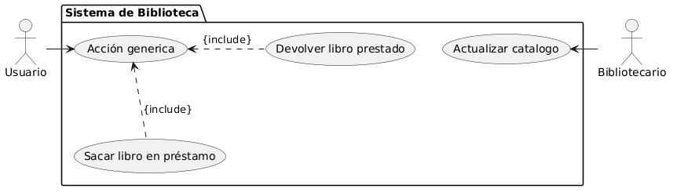

# Sistema de biblioteca

## Indice

* [Enunciado](#enunciado)
* [Actores](#actores)
* [Casos de Uso](#casos-de-uso)
* [Diagrama](#diagrama)

## Enunciado

Se desea desarrollar un sistema de gestión para una biblioteca.

El sistema debe permitir lo siguiente:

* Los usuarios podrán realizar acciones relacionadas con los libros de la biblioteca.
* Entre estas acciones, los usuarios podrán:
    * Sacar libros en préstamo.
    * Devolver libros prestados.
* El sistema debe permitir que estas acciones formen parte de una acción general realizada por
el usuario.
* Los bibliotecarios serán los encargados de actualizar el catálogo de la biblioteca
diariamente.

Se pide:

1. Identificar los actores del sistema.
2. Identificar los casos de uso.
3. Dibujar el diagrama de casos de uso UML con las relaciones correspondientes.

## Actores

* Usuario
* Bibliotecario

## Casos de Uso

* Acción general
* Sacar libro en préstamo
* Devolver libro prestado
* Actualizar catalogo

# Diagrama

Este diagrama fue generado con el codigo que se puede encontrar en `Diagrama.puml`.
