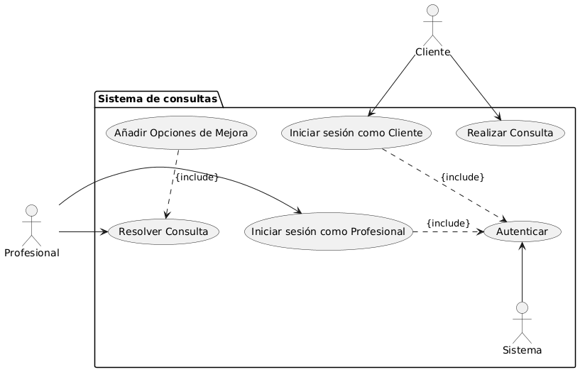

# Sistema de consultas

## Indice

* [Enunciado](#enunciado)
* [Actores](#actores)
* [Casos de uso](#casos-de-uso)
* [Diagrama](#diagrama)

## Enunciado

Se desea desarrollar un sistema de consultas en el que los clientes puedan realizar consultas y los
profesionales se encarguen de resolverlas.

El funcionamiento del sistema es el siguiente:

* Los clientes pueden realizar consultas en el sistema.
* Los profesionales pueden resolver las consultas realizadas por los clientes.
* Tanto los clientes como los profesionales deben autenticarse en el sistema antes de realizar
cualquier acción.
* Cuando un profesional resuelve una consulta, de forma opcional, podrá ofrecer opciones de
mejora relacionadas con la consulta realizada.

Se pide:

1. Identificar los actores del sistema.
2. Identificar los casos de uso.
3. Dibujar el diagrama de casos de uso UML con las relaciones correspondientes.

## Actores

* Cliente
* Profesional
* Sistema

Sistema fue añadido para gestionar la autenticación.

## Casos de uso

* Iniciar sesión como Cliente
* Iniciar sesión como Profesional
* Autenticar
* Realizar Consulta
* Resolver Consulta
* Añadir Opciones de Mejora

Como los actores Cliente y Profesional tienen permisos distintos, he decidido separar Iniciar sesión entre ambos.

## Diagrama

Este diagrama fue generado con el codigo que se puede encontrar en `Diagrama.puml`.
